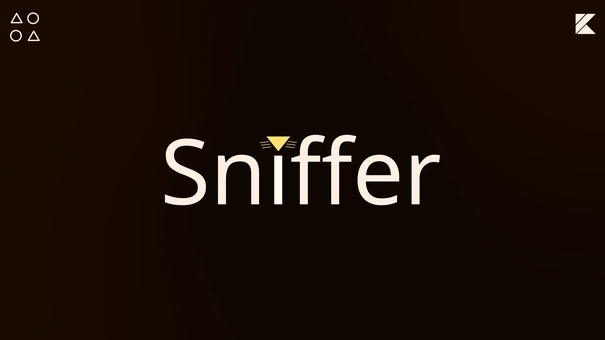

<div align="center">



</div>

# About
Sniffer is a library for fuzzy match strings in kotlin. For example ybe is a match for Youtube. This provides a easy and user friendly way to search for a match without the need for a lot of code.

# Install
To install the library add the the jitpack url in your project `settings.gradle.kts`

```
maven {
    setUrl("https://jitpack.io")
}
```

Then add the library in your app `build.gradle.kts`

```
implementation("com.github.Whiskers-Apps:sniffer-kt:1.0.1")
```

# Usage
The usage of the library is very simple. It provides 4 algorithms for searching and a sniffer object that contains sane defaults for searching.

## Basic match
```kotlin
val sniffer = Sniffer()
val matches = sniffer.matches("banana", "bana")
```

## Case sensitive match
```kotlin
val sniffer = Sniffer(caseSensitive = true)
val matches = sniffer.matches("Banana", "banana")
```

## Levenshtein Algorithm
Returns the amount of characters that are different.
```kotlin
val matches = getLevenshteinDistance("Banana", "banin3")
```

## Hamming Algorithm
Returns the amount of positional characters different. It only works with same size strings.
```kotlin
val matches = getHammingDistance("banana", "banin3")
```

## Jaro Winkler Algorithm
Returns the difference in a percentage. From 0.0 to 1.0.
```kotlin
val matches = getJaroWinklerDistance("banana", "banan")
```

## Inner Algorithm
Returns true if the characters are inside the string.
```kotlin
val matches = getInnerMatch("Sprigatito", "agt")
```

## Sniffer
The sniffer match object can be changed in its intialization in case you don't like the default values.

```kotlin
val sniffer = Sniffer(
    levenshteinDistance = 2,
    doLevenshteinMatch = true,
    hammingDistance = 2,
    doHammingMatch = true,
    jaroWinklerDistance = 0.8,
    doJaroWinklerMatch = true,
    doInnerMatch = true,
    caseSensitive = false
)
```

## Sniffer Result
The sniffer result returns the values of the algorithms from a match. It's more appropriate for debuging. 

```kotlin
val result = getSnifferResult("Luxray", "lux")
```

# Contributors
The people that are helping the project with minor or big changes.

<a href="https://github.com/whiskers-apps/sniffer-kt/graphs/contributors">
  
</a>
